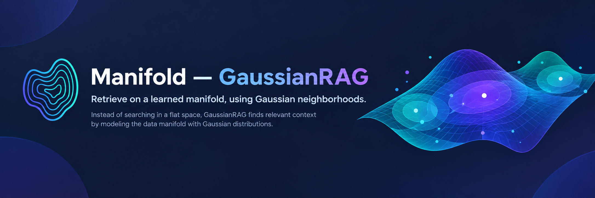

# Manifold — GaussianRAG

> **Probabilistic retrieval-augmented generation on information manifolds.**
>
> Every chunk of knowledge is a Gaussian distribution, not a point. Retrieval is geometry, not cosine.

---

## What This Is

**GaussianRAG** replaces the flat-vector representation used in standard RAG with **multivariate Gaussian distributions**. Each ingested chunk becomes a probability distribution `𝒩(μ, Σ)` living on a **statistical manifold** — the space `ℝᵈ × SPD(d)` equipped with the Fisher-Rao metric from Information Geometry.

This yields three concrete capabilities over point-embedding baselines:

| Capability | How |
|---|---|
| **Uncertainty-aware retrieval** | Confidence weight `w(Σ) = 1/(1+tr(Σ))` down-ranks ambiguous chunks |
| **Polysemy resolution** | 5-agent disambiguation pipeline routes per-sense before retrieval |
| **Self-improving manifold** | Continual learning loop refines `SigmaHead` weights from query radiation |

---

## Architecture at a Glance

```
┌─────────────────────────────────────────────────────────────────┐
│  INGESTION                                                       │
│  Document → Chunker → Encoder(μ) → SigmaHead(Σ) → KnowledgeStore│
└─────────────────────────────┬───────────────────────────────────┘
                              │  Knowledge Manifold { 𝒩(μᵢ, Σᵢ) }
┌─────────────────────────────┴───────────────────────────────────┐
│  DISAMBIGUATION (5-agent pipeline, triggered by polysemy)        │
│  Agent 0 (Query Dissolver) → Agent 1 (Sense Generator)          │
│  → Agent 2 (Domain Grounder) → Agent 3 (Field Mapper)           │
│  → Agent 4 (Memory Packager) → Entropy Router                   │
└─────────────────────────────┬───────────────────────────────────┘
                              │  DisambiguationPacket
┌─────────────────────────────┴───────────────────────────────────┐
│  RETRIEVAL (MMASA — Mother-Agent Multi-Sense Architecture)       │
│  ANN on μ (candidates) → ELK overlap ranking → Diversity filter │
│  Parallel per-sense Worker Nodes → Mother Agent fusion           │
└─────────────────────────────┬───────────────────────────────────┘
                              │  RetrievedChunk list with confidence
┌─────────────────────────────┴───────────────────────────────────┐
│  GENERATION                                                      │
│  Uncertainty-aware context builder → Mistral (provider-backed)  │
└─────────────────────────────┬───────────────────────────────────┘
                              │  Radiation events
┌─────────────────────────────┴───────────────────────────────────┐
│  CONTINUAL LEARNING (OnlineRadiationCollector)                   │
│  Absorb {text, domain} pairs → background SigmaHead fine-tune   │
│  Atomic weight swap → improved model on next query              │
└─────────────────────────────────────────────────────────────────┘
```

---

## The Math

### Core Representation

Every chunk `c` is encoded as:

```
𝒩(μc, Σc),  μc ∈ ℝᵈ,  Σc ∈ SPD(d)
```

- `μc` — central semantic mean (from base encoder, `d` depends on backend — see below)
- `Σc` — directional uncertainty; **not** a scalar — some dimensions are tight, others wide

**Covariance structure** (diagonal + low-rank, tractable at any `d`):

```
Σ = diag(v) + LLᵀ,   v ∈ ℝᵈ₊,   L ∈ ℝᵈˣʳ,   r=8 (default)
```

### Distance Metrics

**Expected Likelihood Kernel (default retrieval metric):**

```
Score(Q, D) = 𝒩(μ_q; μ_d, Σ_q + Σ_d)
```

This is the canonical overlap score used by the live query path. It requires a
query bubble as well as a document bubble, so ELK-backed retrieval always
materializes query covariance.

**Wasserstein-2** (alternate geometric metric — closed form for Gaussians):

```
W₂²(𝒩₁, 𝒩₂) = ‖μ₁-μ₂‖² + tr(Σ₁) + tr(Σ₂) - 2·tr((Σ₁^½ Σ₂ Σ₁^½)^½)
```

The second term is the **Bures metric** on SPD(d). Implemented in `information_geometry.py::wasserstein2`.

**Fisher-Rao** (alternative, reparameterization-invariant):

```python
def fisher_rao(g1, g2):
    whitened = sqrtm(inv(Σ₁)) @ Σ₂ @ sqrtm(inv(Σ₁))
    return sqrt(‖μ₁-μ₂‖² + ‖logm(whitened)‖²_F)
```

### Retrieval Score

```
score(q, cᵢ) = 𝒩(μ_q; μᵢ, Σ_q + Σᵢ)
```

Higher overlap means the query bubble places more probability mass on the
document bubble.

### Covariance Estimation Modes

| Mode | File | How |
|---|---|---|
| `heuristic` | `covariance.py::HeuristicSigmaEstimator` | Empirical cov of 7 augmented views → diag+lowrank |
| `learned` | `covariance.py::LearnedSigmaEstimator` | PyTorch `SigmaHead` MLP trained on radiation corpus |
| `dissolver` | `covariance.py::DissolverSigmaEstimator` | Variance across LLM-generated semantic interpretations |
| `entity_aware` | `covariance.py::EntityAwareSigmaEstimator` | Heuristic blended with entity-density scaling |

**Default is `learned`** — the `SigmaHead` weights are loaded from `.gaussian_rag_weights_{dimension}.pt` at startup.

---

## Embedding Backends

GaussianRAG supports two embedding backends, configured in `config/config.yaml`:

### Local — `all-MiniLM-L6-v2` (d=384)

```yaml
encoder:
  embedding_backend: "local"
  dimension: 384
```

Uses `sentence-transformers` locally. No API key required. Weights stored as `.gaussian_rag_weights_384.pt`.

### Gemini Cloud — `gemini-embedding-2-preview` (default)

```yaml
encoder:
  embedding_backend: "gemini_cloud"
  dimension: 384          # logical placeholder; actual dim set by gemini_cloud.dimensions
  gemini_cloud:
    model: "gemini-embedding-2-preview"
    dimensions: 768       # Matryoshka: 128 | 256 | 512 | 768 | 1536 | 3072 (null = 3072)
    base_url: "https://generativelanguage.googleapis.com/v1beta/openai/"
```

Uses Google's OpenAI-compatible endpoint via the `openai` SDK. Requires `GEMINI_API_KEY` in `.env`. Weights stored as `.gaussian_rag_weights_768.pt` (or matching dimension).

**Batch encoding** uses a `ThreadPoolExecutor` (8 workers) to parallelise API calls and eliminate sequential round-trips during ingestion.

**Rate-limit handling:** The Gemini client retries up to 5 times with exponential back-off on 429 / 503 / 500 errors.

### Dimension Mismatch Handling

If the loaded `.gaussian_rag_weights_{d}.pt` has a different dimension than the current encoder, `on_mismatch` controls behaviour:

| `on_mismatch` | Behaviour |
|---|---|
| `retrain` (default) | Initialise fresh SigmaHead weights; re-train via radiation |
| `heuristic` | Fall back to heuristic Σ silently |
| `error` | Raise `ValueError` (fail fast) |

---

## Continual Learning: The Radiation Loop

Every query now records a structured radiation event and also derives training
samples for the current prototype trainer. The `OnlineRadiationCollector`
(active when `continual_learning.enabled: true`) writes event records to
`data/training/radiation_events.jsonl` and derived `{text, domain}` samples to
`data/training/robust_corpus.jsonl`.

```
Query fired
    │
    ├── Structured event: {query_text, sense_queries, retrieved_docs, feedback_signal}
    ├── {text: query_text,         domain: "query"}
    ├── {text: sense.retrieval_query, domain: sense.domain}
    └── {text: node.text,          domain: node_type}

OnlineRadiationCollector.record_event(event)
    │
OnlineRadiationCollector.collect(radiation)
    │
    ├── Appends to robust_corpus.jsonl (thread-safe)
    ├── Emits SSE: radiation_stats
    │
    └── If pending ≥ train_every_n AND no training running:
            Spawn background daemon thread
                → Fine-tune SigmaHead (2 epochs, batch=4)
                → Atomic rename: .pt.tmp → .gaussian_rag_weights_{dim}.pt
                → Emit SSE: system_log ("✅ SigmaHead run #N complete…")
                → Next /api/query loads improved weights transparently
```

Configuration:

```yaml
continual_learning:
  enabled: true
  train_every_n: 5   # new unique samples before triggering a background retrain
```

The current trainer still learns from the derived sample corpus rather than
explicit click/dwell supervision, so the event log is the audit trail for the
paper-style radiation loop while the trainer remains prototype-shaped.

Monitor absorption and training history via `/api/radiation/stats` or the dashboard sidebar.

---

## Package Layout

```
gaussian_rag/
├── config.py                  # YAML + .env loaders (ProjectConfig, EncoderConfig, ContinualLearningConfig)
├── main.py                    # CLI entry point — ingest/query/answer/visualize/…
│
├── core/
│   ├── types.py               # GaussianKnowledge, QueryRepresentation, RetrievedChunk,
│   │                          #   SenseNode, DisambiguationPacket, MemoryOps
│   ├── gaussian_embedding.py  # GaussianEmbedder — dual backend (local | gemini_cloud),
│   │                          #   encode(), encode_batch(), encode_query(), encode_sense()
│   │                          #   _encode_vectors_batch() — concurrent ThreadPoolExecutor
│   ├── covariance.py          # Heuristic/Learned/Dissolver/EntityAware Σ estimators
│   ├── information_geometry.py# wasserstein2, fisher_rao, kl_divergence, bhattacharyya
│   └── store.py               # KnowledgeStore — flat dict + JSON persistence
│
├── creator/
│   ├── chunker.py             # Paragraph→sentence aware splitter (128 tok, 16 overlap)
│   ├── ingestion.py           # IngestionPipeline — anchor, interpretation & AI-prop nodes
│   └── drift.py               # measure_drift() / mean_drift() via W2 between snapshots
│
├── manifold/
│   ├── manifold.py            # StatisticalManifold wrapper
│   ├── tangent_space.py       # Tangent space operations
│   └── coverage.py            # τ-coverage metric
│
├── rag/
│   ├── sense_cache.py         # SenseCache — TTL-keyed session store for SenseNodes
│   │
│   ├── disambiguation/
│   │   ├── pipeline.py        # disambiguate() — orchestrates Agents 0-4
│   │   ├── query_dissolver.py # Agent 0: LLM query-level ambiguity analysis
│   │   ├── sense_generator.py # Agent 1: LLM polysemy/sense taxonomy
│   │   ├── domain_grounder.py # Agent 2: W2 proximity boost + manifold anchoring
│   │   ├── field_mapper.py    # Agent 3: Bhattacharyya edges + Shannon entropy gate
│   │   ├── memory_packager.py # Agent 4: TTL upsert, confidence boost, prune
│   │   └── router.py          # Entropy router → single/dual/fallback (MMASA)
│   │
│   ├── retrieval/
│   │   ├── ann_index.py       # MuAnnIndex — NumPy linear scan (FAISS-shaped interface)
│   │   ├── manifold_ranker.py # rerank_candidates(), rerank_multi_sense()
│   │   ├── diversity.py       # W2-threshold diversity filter
│   │   ├── retriever.py       # GaussianRetriever + MMASA async parallel multi-sense
│   │   ├── gskg_retriever.py  # Multi-hop entity-graph retrieval
│   │   └── visualizer.py      # PCA→3D Plotly HTML field explorer
│   │
│   └── generation/
│       ├── context_builder.py # build_context() / build_multi_sense_context()
│       ├── prompt_templates.py# uncertainty_prompt()
│       ├── generator.py       # SimpleGenerator / ProviderBackedGenerator
│       └── provider.py        # MistralChatClient (httpx)
│
├── training/
│   ├── losses.py              # contrastive_w2_loss, augmentation_consistency_loss,
│   │                          #   covariance_regularization_loss
│   ├── sigma_head.py          # SigmaHead — PyTorch MLP (shared + diag + low-rank heads)
│   │                          #   Softplus activation; predict() for NumPy inference
│   ├── augmentation.py        # Text augmentation helpers (positive pair generation)
│   ├── trainer.py             # SigmaTrainer + DomainTextDataset (JSONL loader)
│   └── online_trainer.py      # OnlineRadiationCollector — continual learning daemon
│                              #   Appends radiation, triggers background fine-tune,
│                              #   atomic weight swap, SSE emission, persistent stats
│
└── evaluation/
    ├── metrics.py             # ndcg_at_k, recall_at_k, precision_at_k
    ├── benchmarks.py          # demo_benchmark() — 3-doc built-in corpus
    ├── stratifier.py          # ambiguity_bucket() — low/medium/high by lexical entropy
    └── ablation.py            # AblationResult dataclass
```

Top-level files of note:

```
dashboard_server.py            # FastAPI server (port 8001) with SSE + radiation collector
run_training.py                # Manual SigmaHead training entrypoint
.gaussian_rag_weights_384.pt   # Saved weights for d=384 (local backend)
.gaussian_rag_weights_768.pt   # Saved weights for d=768 (Gemini Cloud backend)
data/training/robust_corpus.jsonl  # Append-only radiation training corpus (JSONL)
data/training/radiation_stats.json # Persistent absorption + training run history
docs/ABOUT.md                  # Deep-dive Q&A on SigmaHead and continual learning
detailed_explanation_markdown/ # Information geometry theory docs
```

---

## SigmaHead Architecture

`training/sigma_head.py`:

```
Input: hidden_state  ∈ ℝᵈ  (base encoder output)
    │
    ▼ fc_shared: Linear(d→d) + ReLU
    │
    ├── fc_diag:     Linear(d→d)   → Softplus + floor(1e-6) → diag ∈ ℝᵈ₊
    └── fc_low_rank: Linear(d→d·r) → reshape → L ∈ ℝᵈˣʳ

Output: Σ = diag(diag²) + L·Lᵀ
```

Weights are dimension-specific: a `d=384` head cannot load a `d=768` checkpoint. The `on_mismatch` config key handles this gracefully.

---

## Dashboard

Full-stack interactive interface:

- **Backend:** FastAPI (`dashboard_server.py`, port 8001) — SSE event stream for real-time progress
- **Frontend:** Vite/React app (`dashboard/`) — runs on `:5173`

### API Endpoints

| Endpoint | What it does |
|---|---|
| `POST /api/ingest` | Upload `.txt`, runs full ingestion pipeline, creates session, collects radiation |
| `POST /api/query` | Disambiguate → MMASA retrieve → generate → collect radiation → returns answer + sources |
| `GET /api/nodes` | All `GaussianKnowledge` nodes in active store |
| `GET /api/sessions` | List manifold sessions and branched chats |
| `POST /api/sessions/switch` | Load a different session's `KnowledgeStore` |
| `POST /api/sessions/new_chat` | Branch current session (pointer, no copy) |
| `GET /api/sessions/{id}/history` | Chat history for a session |
| `GET /api/radiation/stats` | Cumulative absorption and training run statistics |
| `GET /api/events` | SSE stream of all pipeline events |

### SSE Events

| Event type | Emitted when |
|---|---|
| `query_received` | Query arrives at `/api/query` |
| `query_disambiguation_started` | Agent pipeline begins |
| `query_senses_detected` | Packet ready — includes entropy and per-sense weights |
| `query_retrieval_started` | MMASA begins |
| `query_retrieval_complete` | Results ranked and returned |
| `query_generation_started` | LLM prompt assembled |
| `query_generation_complete` | Answer ready |
| `system_log` | Info/warning messages from any component |
| `radiation_stats` | After every `collect()` call and training completion |

Start it:

```bash
uv run python dashboard_server.py   # API on :8001
cd dashboard && npm run dev          # UI on :5173
```

---

## CLI Usage

```bash
# Ingest documents
uv run python -m gaussian_rag.main ingest --input my_docs/ --output .gaussian_rag_store

# Standard query (ELK overlap)
uv run python -m gaussian_rag.main query --store .gaussian_rag_store --text "..." --top-k 5

# Fisher-Rao metric
uv run python -m gaussian_rag.main query --store .gaussian_rag_store --text "..." --metric fisher_rao

# Polysemy-aware query (requires MISTRAL_API_KEY)
uv run python -m gaussian_rag.main polysemy-query --store .gaussian_rag_store --text "Apple trial outcomes"

# Full RAG answer (retrieval + Mistral generation)
uv run python -m gaussian_rag.main answer --store .gaussian_rag_store --text "..."

# Built-in demo (no store needed)
uv run python -m gaussian_rag.main demo-query --text "ambiguous treatment guidance"

# Evaluate (nDCG@k + Recall@k on built-in benchmark)
uv run python -m gaussian_rag.main evaluate --benchmark demo --top-k 3

# Interactive 3D field visualizer
uv run python -m gaussian_rag.main visualize --store .gaussian_rag_store --output .visualizer
```

All commands output JSON to stdout.

---

## Installation

```bash
git clone <repo> && cd manifold

# Install core dependencies
uv sync

# With dev tools (pytest)
uv sync --extra dev

# With PyTorch (required for sigma_mode=learned — the default)
uv sync --extra research

# Configure
cp .env.example .env
# Edit .env: MISTRAL_API_KEY, GEMINI_API_KEY (if using gemini_cloud backend)
```

### Environment Variables

```bash
# LLM generation (required)
MISTRAL_API_KEY="sk-..."
MISTRAL_BASE_URL="https://api.mistral.ai/v1/chat/completions"
MISTRAL_MODEL="mistral-small-latest"

# Gemini Cloud embedding (required if embedding_backend = "gemini_cloud")
GEMINI_API_KEY="AIza..."

# Runtime
GAUSSIAN_RAG_STORE_PATH=".gaussian_rag_store"
GAUSSIAN_RAG_TOP_K=5
```

### Config: `config/config.yaml`

```yaml
encoder:
  embedding_backend: "gemini_cloud"   # "local" | "gemini_cloud"
  dimension: 384                       # logical default; overridden by actual model dim
  sigma_mode: "learned"                # "heuristic" | "learned" | "dissolver" | "entity_aware"
  low_rank: 8
  on_mismatch: "retrain"              # "retrain" | "heuristic" | "error"

  gemini_cloud:
    model: "gemini-embedding-2-preview"
    dimensions: 768                    # Matryoshka: 128|256|512|768|1536|3072 (null=3072)
    base_url: "https://generativelanguage.googleapis.com/v1beta/openai/"

chunking:
  max_tokens: 128
  overlap_tokens: 16

retrieval:
  ann_candidates: 10
  top_k: 5
  metric: "elk"                        # "elk" | "wasserstein2" | "fisher_rao"
  diversity_threshold: 0.3

generation:
  mode: "provider"
  provider: "mistral"
  model: "mistral-small-latest"
  timeout_seconds: 30.0

continual_learning:
  enabled: true
  train_every_n: 5                     # samples before triggering background retrain

evaluation:
  ambiguity_buckets:
    medium_entropy: 2.5
    high_entropy: 4.0
```

---

## Manual SigmaHead Training

To train from scratch or re-train on a custom corpus:

```bash
# Add your own data to the corpus
echo '{"text": "Your fact here", "domain": "custom"}' >> data/training/robust_corpus.jsonl

# Run training
uv run python run_training.py
```

Weights are saved as `.gaussian_rag_weights_{dimension}.pt`. Set `sigma_mode: "learned"` in config to activate them. See `docs/ABOUT.md` for a full Q&A on the training process.

---

## Python API

```python
from gaussian_rag.core.gaussian_embedding import GaussianEmbedder
from gaussian_rag.creator.ingestion import IngestionPipeline
from gaussian_rag.core.store import KnowledgeStore
from gaussian_rag.rag.retrieval.retriever import GaussianRetriever

# Setup (uses config/config.yaml backend by default)
embedder = GaussianEmbedder(sigma_mode="learned", rank=8, embedding_backend="gemini_cloud")
pipeline = IngestionPipeline(embedder)
store = KnowledgeStore()

# Ingest
nodes = pipeline.ingest_document("Your text here...", document_id="doc-1")
store.add(nodes)
store.save(".gaussian_rag_store")

# Query
retriever = GaussianRetriever(store)
retriever.refresh()
query = embedder.encode_query("What controls blood flow?", with_covariance=True)
results = retriever.retrieve(query, top_k=5, metric="elk")

for r in results:
    print(r.rank, r.uncertainty_label, f"ELK={r.elk_score:.3f}", r.knowledge.text[:80])
```

With disambiguation:

```python
from gaussian_rag.rag.sense_cache import SenseCache
from gaussian_rag.rag.disambiguation.pipeline import disambiguate
from gaussian_rag.rag.disambiguation.router import route

cache = SenseCache()
def my_llm(prompt: str) -> str: ...  # wire to Mistral/OpenAI

packet = disambiguate("Apple trial outcomes", embedder, cache, llm_caller=my_llm)
print(f"Entropy: {packet.entropy:.2f} bits")

sense_results, fallback = route(packet, embedder, retriever, top_k=5)
```

With radiation collection:

```python
from gaussian_rag.training.online_trainer import OnlineRadiationCollector

collector = OnlineRadiationCollector(train_every_n=5)

# After every query
collector.collect([
    {"text": query_text, "domain": "query"},
    {"text": retrieved_chunk.text, "domain": "anchor"},
])

# Check stats
print(collector.get_stats())
```

---

## Testing

```bash
uv run pytest                          # full suite
uv run pytest -v -k "not cli"          # unit tests only (fast)
uv run pytest -v -k test_ablation      # specific test
```

---

## Design Decisions

| Decision | Choice | Rationale |
|---|---|---|
| Covariance structure | diag + low-rank (r=8) | Tractable at any d; captures dominant cross-axis correlations |
| Primary retrieval metric | Expected Likelihood Kernel | Canonical query/document Gaussian overlap from the paper |
| Retrieval stages | ANN on μ → exact ELK re-rank | Fast filter then paper-aligned overlap scoring |
| Embedding backend | Dual: local or Gemini Cloud | Local for offline/dev; Gemini for higher-quality μ in production |
| Dimension-specific weights | `.gaussian_rag_weights_{d}.pt` | Prevents silent geometry corruption on backend switches |
| `on_mismatch` policy | Config-driven (`retrain`/`heuristic`/`error`) | Graceful degradation vs. fail-fast depending on use case |
| Continual learning trigger | Count-based (default N=5) | Balances responsiveness vs. training overhead |
| Atomic weight swap | `.pt.tmp` → rename | Prevents corrupt weights being loaded mid-request |
| KL divergence | Training loss only | Asymmetric; undefined for non-overlapping support |
| SPD floor | ε=1e-6 eigenvalue clipping | Prevents manifold degeneracy (Σ → singular) |
| Uncertainty → LLM | Prompt labels HIGH/MEDIUM/LOW | No architecture changes; works with any API-backed LLM |

---

## Dependencies

| Package | Purpose |
|---|---|
| `numpy>=1.26` | All manifold math (W2, FR, Bures) |
| `sentence-transformers>=3.0` | `all-MiniLM-L6-v2` encoder (local backend) |
| `openai>=2.33.0` | Gemini Cloud embedding via OpenAI-compatible API |
| `pyyaml>=6.0.1` | Config loading |
| `httpx>=0.27` | Mistral API client |
| `fastapi` + `uvicorn` | Dashboard API server + SSE |
| `pytest>=8.2` (`dev` extra) | Test suite |
| `torch>=2.2` (`research` extra) | SigmaHead training and inference — **required for `sigma_mode=learned`** |

> **Note:** `torch` is listed as a `research` extra but is effectively required when running with the default `sigma_mode: "learned"` config. Install with `uv sync --extra research`.

---

## Further Reading

- `docs/ABOUT.md` — Q&A on SigmaHead training, self-supervised learning, and the radiation loop
- `detailed_explanation_markdown/` — Theory docs: information geometry, uncertainty bubbles, retrieval mechanics, SigmaHead deep dive, continual learning
